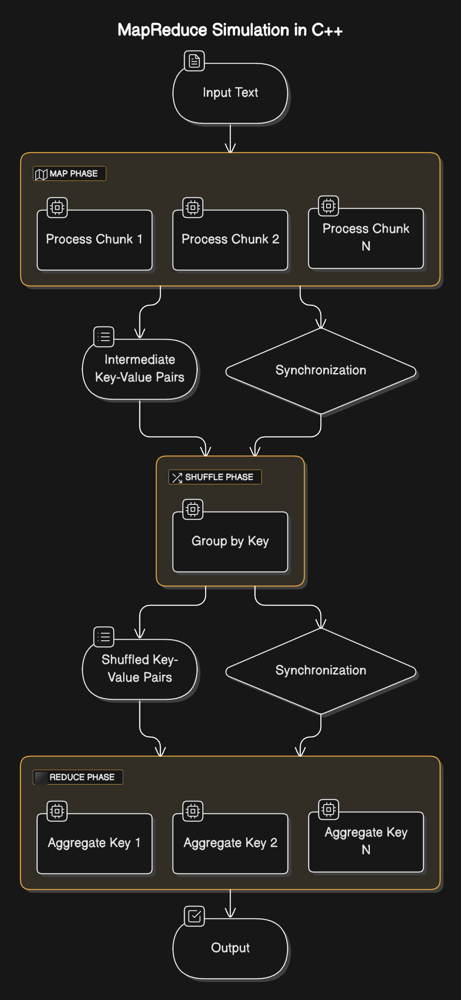

# Multithreaded MapReduce Word Count System

## Overview

This project implements a simplified MapReduce model for parallel word counting, demonstrating efficient data processing using multithreading techniques. The system breaks down text processing into four key phases: Input Processing, Mapping, Shuffling, and Reducing.

## Project Structure

```
Multithreaded-MapReduce-Word-Count-In-CPP/
│
├── Makefile            # Build configuration and commands
├── main.cpp            # Main program entry point
├── functions.cpp       # Implementation of core MapReduce functions
├── functions.h         # Header file with function declarations
└── testcases.cpp       # Test cases for the MapReduce implementation
```

## Key Features

- **Parallel Processing**: Utilizes POSIX threads (pthreads) for concurrent word counting
- **Thread Safety**: Implements mutexes and semaphores to protect shared data structures
- **Memory Efficiency**: Systematic memory management to prevent leaks
- **Scalable Design**: Modular architecture supporting various input sizes

## System Architecture

The word count system follows the classic MapReduce workflow:

1. **Input Processing**: 
   - Sanitize input text
   - Remove special characters
   - Convert to lowercase
   - Distribute text chunks to mapper threads

2. **Mapping Phase**:
   - Generate key-value pairs for each word
   - Thread-safe intermediate data storage

3. **Shuffling Phase**:
   - Group and organize key-value pairs
   - Prepare data for reduction

4. **Reducing Phase**:
   - Aggregate word counts
   - Generate final output

## System Architecture Diagram
<p align="center">
    
</p>

**Explanation:**
- **Input Processing**: The raw input text is cleaned, converted into words, and distributed to mapper threads.
- **Mapping Phase**: Parallel threads process text chunks independently and generate intermediate key-value pairs for each word.
- **Shuffling Phase**: A centralized process sorts and groups the key-value pairs for easier reduction.
- **Reducing Phase**: Multiple threads work on grouped keys to calculate the final counts.
- **Final Output**: The aggregated word frequencies are displayed in a user-friendly format.

## Prerequisites

- C++ Compiler (with pthread support)
- Make utility
- POSIX-compatible operating system

## Building the Project

### Compile and Run Main Program
```bash
make main
```

### Run Test Cases
```bash
make test
```

### Compile Without Running
```bash
make
# or
make all
```

### Clean Compiled Files
```bash
make clean
```

## Performance Characteristics

- Efficiently processes large text inputs
- Minimal overhead from thread synchronization
- Scales well with increasing input size

## Test Coverage

The implementation includes comprehensive test cases:
- Basic word count scenarios
- Edge cases (single words, empty inputs)
- Stress tests with large text volumes
- Special character and mixed-case handling

## License

This project is licensed under the MIT License - see the [MIT License](https://opensource.org/license/MIT) file for details.
